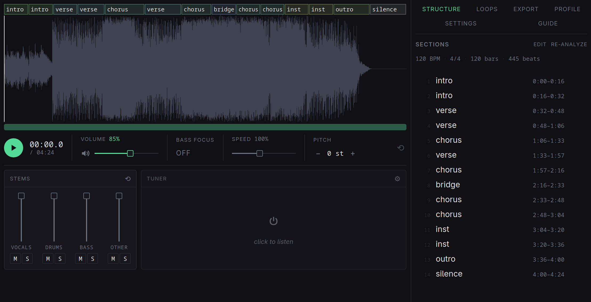

<p align="center">
  
</p>

<h1 align="center">Dredge Looper</h1>

<p align="center">
  An ear-first practice looper for Linux: load a song, loop a section, slow it
  down without changing pitch, and drill it with a tempo trainer.
</p>

<p align="center">
  <a href="https://github.com/ShawnMcCool/dredge/releases">Releases</a> ·
  <a href="#install">Install</a> ·
  <a href="#dependencies">Dependencies</a> ·
  <a href="DEVELOPMENT.md">Build &amp; develop</a>
</p>

---

> [!NOTE]
> **Honest state of the project.** This has only ever been tried on two
> computers, each running Arch Linux. Not having tested on other setups, I
> don't know what assumptions are being made that might cause a break. Please
> [report an issue](https://github.com/ShawnMcCool/dredge/issues) for anything
> you'd like to see fixed.

## Features

### Basic

These work with the installed app — no ML setup.

- **Sample-accurate looping** — crossfaded loop seam, set by dragging on the waveform.
- **Pitch-preserving speed** — 0.25–2.0× via Rubber Band R3; independent pitch shift, ±12 semitones plus cents.
- **Drill** — tempo trainer that raises speed across passes, with region shaping and a recall mode that mutes playback so you play from memory.
- **Bass focus** — octave-up plus low-pass to isolate basslines.
- **Tuner** — chromatic tuner in the stage; note and cents with a hold-to-lock confirm. Works with no song loaded.
- **Sections and notes** — add sections by hand; per-section free text with inline tablature, keyed to the section occurrence (`verse 2`).
- **Auto-named loops** — loops take the name of the sections they span (`verse 2 → chorus 1`).
- **Export** — render the current mix (stem balance, speed, pitch, bass focus) to WAV, or MP3 with `ffmpeg`.
- **Song bundles** — each song is a self-contained directory (audio + `dredge.json` holding sections, loops, notes, analysis). Diffable, portable; copy the folder to another machine and it loads with everything.
- **Control socket** — JSON commands over a Unix socket drive everything the UI can.

### With ML enabled

These require the optional Python tools in [Dependencies](#dependencies).

- **Detected song structure** — beats, downbeats, BPM, and labelled sections detected and drawn on the waveform.
- **Downbeat snapping** — loop and selection edges snap to detected downbeats.
- **Stems** — 4-stem separation (vocals / drums / bass / other) with per-stem faders. Runs locally.

## Install

Linux only. The audio engine is PipeWire-native: **PipeWire 1.0+ is required**, with no ALSA or PulseAudio fallback.

> ### 🩺 `dredge-doctor`
> Run it any time to see which optional tools are installed and the exact command to add each missing one. The desktop app shows the same under Settings → capabilities.

### Basic

**Arch / Arch-based**

```bash
yay -S dredge   # builds from source against your system libraries
```

**Debian / Ubuntu** (24.04+ / Debian 13+)

Download the latest `dredge_*_amd64.deb` from the
[releases page](https://github.com/ShawnMcCool/dredge/releases), then:

```bash
sudo apt install ./dredge_*_amd64.deb
```

`apt` pulls the runtime libraries automatically. The basic features above run with nothing else installed.

### ML enabled

Beat/section analysis and stem separation are off by default and self-bootstrap on first use; `dredge-enable-ml` does that bootstrap up front so the first run isn't a multi-minute download. Each piece is an isolated `uv` virtualenv (or tool) and requires [`uv`](https://docs.astral.sh/uv/) on PATH.

```bash
dredge-enable-ml all          # analyze + songformer + stems
dredge-enable-ml analyze      # beat/section analysis only
dredge-enable-ml songformer   # higher-quality section labels
dredge-enable-ml stems        # stem separation only
```

A GPU is optional throughout — CPU works, slower. The virtualenvs and model weights take several GB of disk. See [Dependencies](#dependencies) for what each piece installs.

## Dependencies

### Basic

| Component | Required for | Install |
|---|---|---|
| **PipeWire 1.0+** | the app to run at all | system package (`pipewire`) |
| **rubberband** | pitch-preserving slow-down (the core stretch engine — the app won't start without it) | `sudo pacman -S rubberband` · `sudo apt install librubberband2` · `sudo dnf install rubberband` |
| **Runtime libraries** (webkit2gtk-4.1, gtk3, …) | the app to run | rubberband + these are pulled in automatically by the `.deb` (`apt`) and the `dredge` AUR package — nothing to do |
| **ffmpeg** | MP3 export, mkv/webm containers, stem export | `sudo apt install ffmpeg` · `sudo pacman -S ffmpeg` |

> The `.deb` and the `dredge` AUR package install rubberband for you; the line above is only for a hand-rolled setup (e.g. running the prebuilt `dredge-*-x86_64-linux.tar.gz` directly). The prebuilt binaries target Debian/Ubuntu library versions — on Arch, use the `dredge` package, which builds against your system's rubberband.

### ML enabled

All ML pieces require **`uv`** on PATH: `sudo pacman -S uv`, or on Ubuntu `curl -LsSf https://astral.sh/uv/install.sh | sh`.

**Beat / section analysis** (`dredge-enable-ml analyze`)

- venv: `~/.local/share/dredge/analyze-venv`, Python 3.12 (override path with `$DREDGE_ANALYZE_VENV`)
- packages: `beat_this` (from git), `torch`, `soundfile`, `librosa`, `einops`, `rotary-embedding-torch`
- provides: beat / downbeat / BPM grid (beat_this) and novelty-based section boundaries
- disk: torch download, several GB

**Higher-quality sections** (`dredge-enable-ml songformer`)

- venv: `~/.local/share/dredge/songformer-venv`, Python 3.11 (override with `$DREDGE_SONGFORMER_VENV`)
- packages: `torch==2.4.0`, `torchaudio==2.4.0`, `numpy<2`, `transformers==4.51.1`, `librosa`, `soundfile`, `ema-pytorch`, `loguru`, `omegaconf`, `tqdm`, `safetensors`, `muq`, `x-transformers`, `msaf`, `einops`, `huggingface_hub`
- also downloads the `ASLP-lab/SongFormer` model snapshot from Hugging Face on first run (weights plus its own modeling code)
- runs alongside the beat grid, so it also needs the analyze venv above
- VRAM at run time: ~8 GB resident, brief peak up to ~15 GB. Falls back to the novelty detector if the venv is absent or the run runs out of memory.

**Stem separation** (`dredge-enable-ml stems`)

- installed as a `uv` tool: `uv tool install demucs --with torchcodec`
- provides: 4-stem separation (vocals / drums / bass / other)
- needs `ffmpeg` (above) for stem export
- disk: PyTorch, ~2.5 GB

---

Built with Rust, Tauri 2, and Svelte 5. Building from source or hacking on it?
See **[DEVELOPMENT.md](DEVELOPMENT.md)**. MIT licensed.
